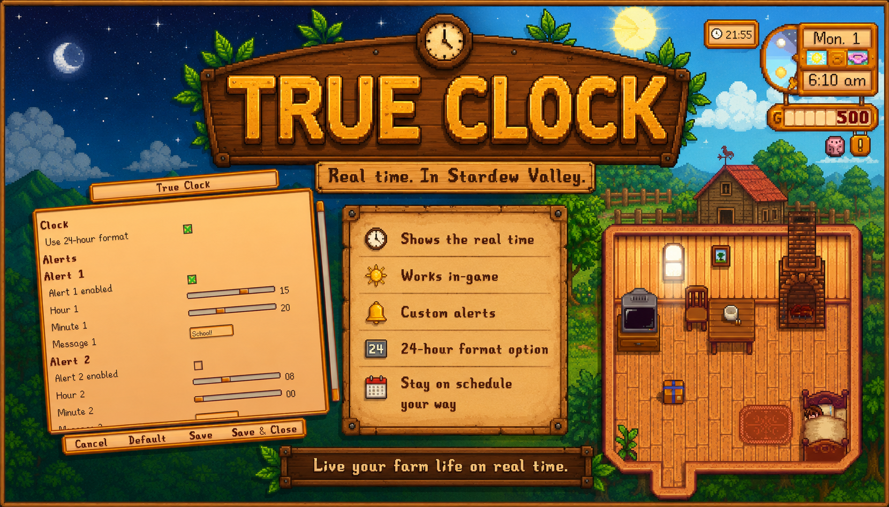
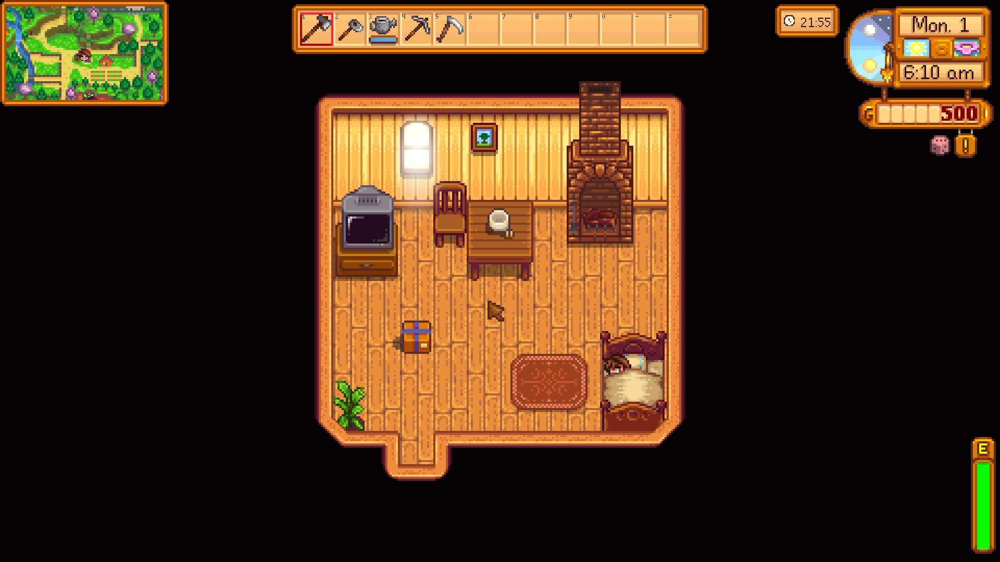
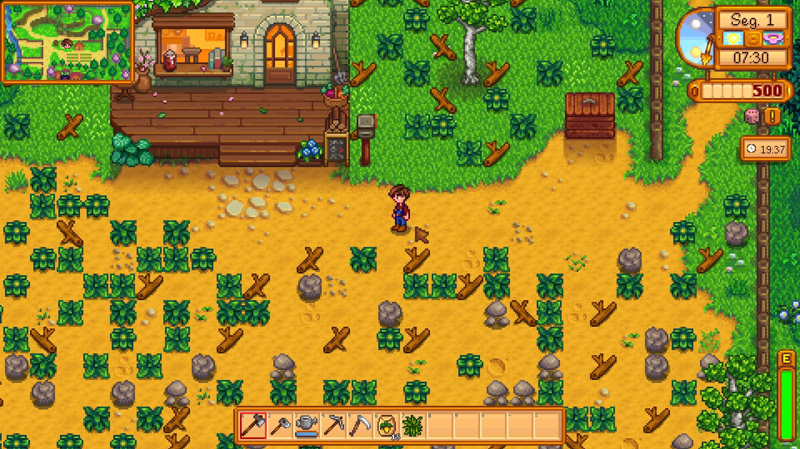
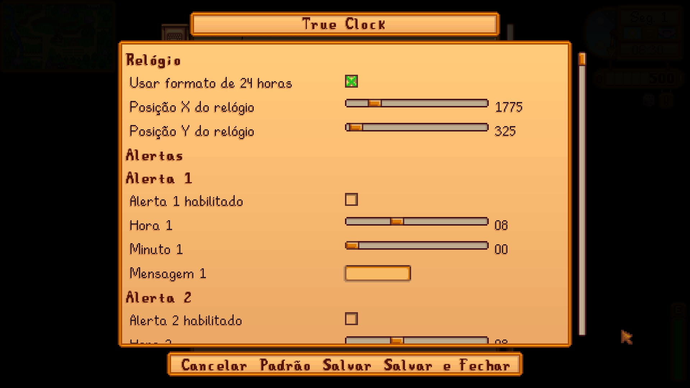

# True Clock



| Idioma |  |  |  |  |  |
|---|---|---|---|---|---|
| [English](../README.md) | **Português do Brasil** | [Español](README.es.md) | [日本語](README.ja.md) | [Français](README.fr.md) | [Italiano](README.it.md) |

True Clock é um mod SMAPI para Stardew Valley que mostra o horário real local no HUD do jogo. Ele também oferece até cinco alertas configuráveis em horário real, com balão de relógio sobre o jogador, uma pequena mensagem no HUD e um som curto de alarme.

O relógio usa o horário local do seu computador, não o horário do jogo em Stardew Valley.

## Capturas De Tela



O relógio começa na posição padrão no canto superior direito.



Os jogadores podem mover o relógio alterando sua posição X e Y.



A página de configuração inclui opções de posição do relógio e configurações de alertas.

## Recursos

- Mostra o horário real local no HUD.
- Permite definir a posição do relógio com coordenadas numéricas X e Y.
- Usa o estilo de UI nativo do Stardew Valley.
- Suporta formato 24 horas ou AM/PM.
- Suporta até cinco alertas configuráveis.
- Cada alerta pode ser habilitado ou desabilitado separadamente.
- Cada alerta tem hora, minuto e mensagem opcional.
- Alertas disparam no máximo uma vez por dia civil.
- Alertas duram até cinco segundos e não pausam o jogo nem bloqueiam comandos.
- Suporte opcional ao Generic Mod Config Menu.

## Requisitos

- Stardew Valley
- SMAPI 4.0.0 ou mais recente
- .NET 6 SDK apenas se você quiser compilar o mod a partir do código-fonte
- Generic Mod Config Menu é opcional

## Instalação Pelo Nexus Mods

True Clock também poderá ser instalado pelo Nexus Mods quando a página do mod for publicada.

- Nexus Mods Stardew Valley: https://www.nexusmods.com/stardewvalley
- Página do mod: será adicionada depois que o ID do Nexus Mods estiver disponível

Baixe o arquivo do mod pelo Nexus Mods e extraia dentro da pasta `Mods` do Stardew Valley.

## Instalação Pelo ZIP Da Release

1. Instale o SMAPI em https://smapi.io/.
2. Baixe o `TrueClock.zip` mais recente na página de Releases do GitHub.
3. Extraia o ZIP dentro da pasta `Mods` do Stardew Valley.
4. Confira se a pasta final ficou assim:

```text
Stardew Valley/
  Mods/
    TrueClock/
      manifest.json
      TrueClock.dll
      i18n/
```

5. Inicie o jogo pelo SMAPI.

Na primeira execução, o mod cria `config.json` dentro da pasta do mod `TrueClock`.

## Configuração

Se o Generic Mod Config Menu estiver instalado, abra as configurações do mod dentro do jogo e configure a posição do relógio e os alertas por lá. A posição do relógio usa coordenadas numéricas do HUD: `ClockX` move o relógio horizontalmente, e `ClockY` move o relógio verticalmente.

A posição padrão é o posicionamento original no canto superior direito. Em `config.json`, `ClockX` usa `-1` como padrão, o que diz ao mod para calcular automaticamente a coordenada X no canto superior direito de acordo com o tamanho atual da UI. Quando um jogador altera o valor de X no menu de configurações, o mod salva a coordenada numérica escolhida.

Sem o Generic Mod Config Menu, edite manualmente `config.json` depois da primeira execução. O mod sempre mantém exatamente cinco slots de alerta.

Exemplo:

```json
{
  "Use24HourClock": true,
  "ClockX": -1,
  "ClockY": 8,
  "Alerts": [
    {
      "Enabled": true,
      "Hour": 8,
      "Minute": 30,
      "Message": "Hora de verificar a fazenda"
    }
  ]
}
```

`ClockX` e `ClockY` usam coordenadas de pixel do HUD. `ClockX: -1` mantém o padrão automático no canto superior direito; use `0` ou maior para uma posição X personalizada fixa. `ClockY` usa `8` como padrão.

As horas usam o horário real local em formato 24 horas, de `0` a `23`. Os minutos usam `0` a `59`.

## Compilando A Partir Do Código-Fonte

Instale o .NET 6 SDK e execute:

```bash
dotnet build -c Release
```

O workflow de release deste repositório compila o mod e publica um arquivo ZIP nas Releases do GitHub.

## ZIP De Release No GitHub

As releases oficiais são geradas pelo GitHub Actions. Quando uma tag de versão como `v1.0.0` é enviada, o workflow compila o mod, cria `TrueClock.zip` e anexa o arquivo à Release do GitHub.

## Autor

Regivaldo (Sun)  
Email: regivaldorfs@gmail.com  
Site: https://regivaldo.com.br  
Nexus Mods: https://www.nexusmods.com/profile/regivaldorfs
